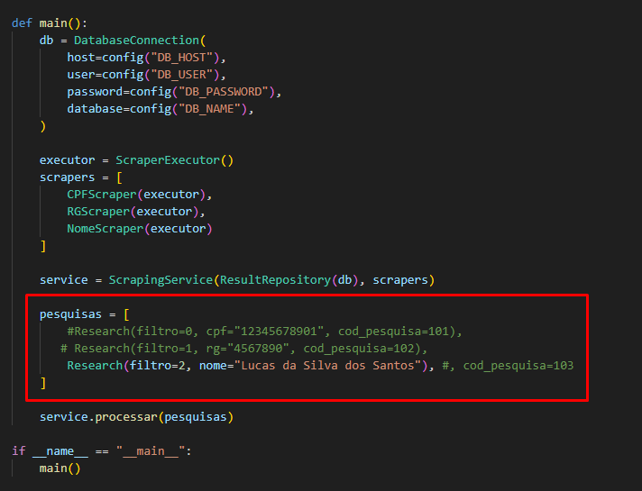

# Projeto: Scraper Judicial com Backup Automático e Integração com PostgreSQL

## Visão Geral

Este projeto realiza **web scraping avançado** no site do **Tribunal de Justiça de São Paulo (TJSP)**, extraindo e persistindo dados estruturados de processos judiciais. Toda a automação está conectada a um banco **PostgreSQL**, com suporte a **backup inteligente em Excel** em caso de falha, e recuperação automática de dados ao reiniciar o sistema.

> Foco em confiabilidade, rastreabilidade e automação de ponta a ponta.

## OBS: O projeto foi feico em curto periodo de tempo.

---

## Funcionalidades

* 📄 Consulta de processos por **nome completo**, **CPF** ou **RG**;
* 🔁 Paginação e scraping de múltiplas páginas de resultados;
* 🧾 Coleta de dados como: número do processo, foro, vara, classe, assunto e datas;
* 🗃️ Estrutura relacional com múltiplas tabelas:

  * `pesquisa`, `pesquisa_spv`, `lote`, `lote_pesquisa`, `estado`, `servico`
* 💥 Backup automático `.xlsx` em caso de falha na gravação dos dados;
* 🔁 Reprocessamento de backups pendentes antes de executar novo scraping;
* 🔄 Suporte a atualização ou ignorar dados já existentes (via `.env`).

---

## Como Executar

### 1. Clonar o repositório e instalar dependências

```bash
python -m venv venv
venv\Scripts\activate
pip install -r requirements.txt
```

### 2. Configurar variáveis de ambiente

Crie um arquivo `.env` com as informações do seu banco PostgreSQL:

```ini
DB_HOST=localhost
DB_USER=postgres
DB_PASSWORD=postgres
DB_NAME=teste_fidelity

UPDATE_EXISTING_RECORDS=false  # ou true para atualizar registros existentes
```

### 3. Criar as tabelas no banco

```bash
python scripts/create_tables.py
```

### 4. (Opcional) Inserir dados mock para teste

```bash
python scripts/insert_mock_data.py
```

### 5. Executar o scraping
- No arquivo main.py você pode alterar o meio de pesquisa se necessário

```bash
python main.py
```

---

## Estrutura de Dados

### 🔹 Tabela `pesquisa`

Representa os dados da pessoa consultada (nome, CPF, RG, data de nascimento etc.).

### 🔹 Tabela `pesquisa_spv`

Registra o resultado da consulta feita (nada consta, consta criminal, consta cível, erro).

### 🔹 Tabela `lote` e `lote_pesquisa`

Permitem agrupar múltiplas pesquisas em "lotes" para controle e rastreabilidade.

### 🔹 Tabela `estado`

Armazena os estados/UF das origens dos processos.

### 🔹 Tabela `servico`

Define o tipo de consulta associada à pesquisa (ex: TJSP).

---

## Sistema de Backup

* Toda vez que houver falha ao salvar no banco, os dados da pesquisa são exportados em `.xlsx` no diretório raiz.
* O nome do arquivo segue o padrão: `backup_YYYY-MM-DD_HH-MM-SS.xlsx`.
* Na próxima execução, o sistema verifica a existência desses backups e os processa **antes** de iniciar novo scraping.
* Após processar os backups com sucesso, o sistema os remove automaticamente.

---

## Design Robusto e Profissional

Este projeto foi desenvolvido com foco em:

* Boas práticas de engenharia de dados
* Organização modular e desacoplada (models, services, repositories, utils)
* Tolerância a falhas com rotas de fallback
* Performance com scraping paginado e seletivo
* Logs e mensagens compreensíveis em CLI

---